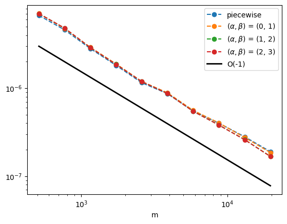
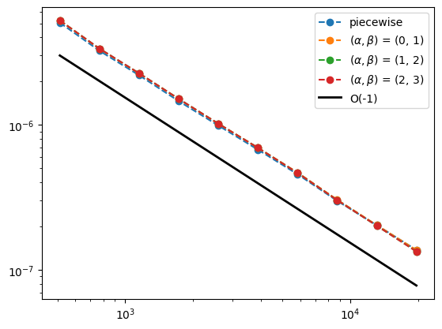
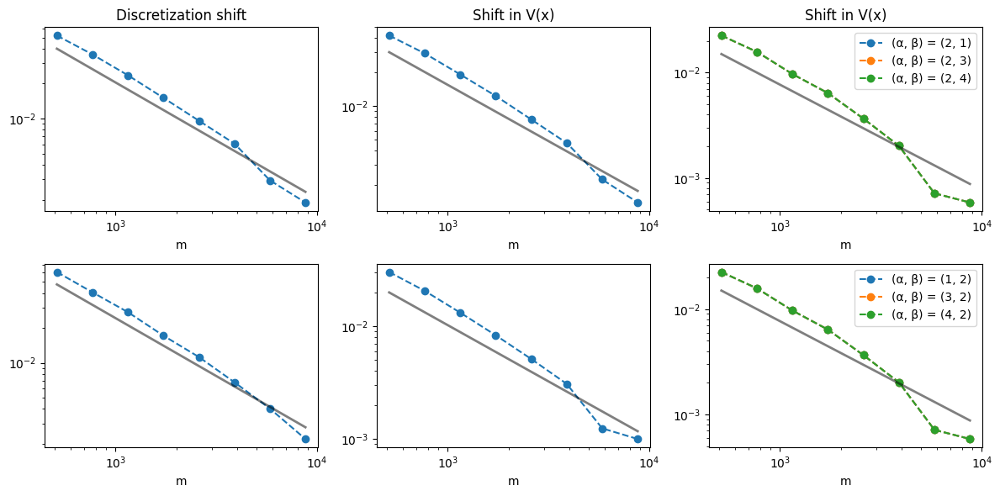

# Diversity of Random Matrices

We evaluate the in-context learning capabilities of a simplified (linear) transformer model for random matrices. Specifically, we train and test against discretizations of Schrodinger operators. We also measure capabilities of in-domain generalization (training and testing on the same discretization method) and capabilities of out-of-domain generalization (training and testing on different discretization methods).

## 1D System

Consider the system $Ax=y$, where the entries of $x \sim N(0,1)$ and $A$ represents a discretization of the operator
$$u(x) \rightarrow -\Delta (a(x)\nabla u(x)) + V(x)u(x), \quad u(0)=u(1)=0$$

$a$ can follow a constant function or lognormal distribution, and $V$ can follow a piecewise function or lognormal distribution (see the `get_a` and `get_V` functions).

## Discretization methods

Both the finite difference (FD) and finite element (FEM) discretization methods for generating $A$ are in `utils/data_utils.py`. For in-domain generalization, we train and test on FD. For out-of-domain generalization, we train on FD and test on FEM. This is modifiable in `one_d/vary_m/test.py` and `two_d/vary_m/test.py`.

## 2D System

The 2D system follows the operator $u(x,y) \rightarrow -\Delta (a(x,y)\nabla u(x,y)) + V(x,y)u(x,y), \quad u=0$ on the boundary. 2D functions for $a$, $V$, FD, and FEM are available in `utils/data_utils.py`. The training is analogous to the 1D system.

## Running the code

For 1D:
- navigate to root dir
```
python -m one_d.vary_m.test
python -m one_d.vary_m.train
```
The 2D procedures are the same, but with `two_d` instead. To change in-domain vs out-of-domain, change `A = generate_A_1d_fd_batch(...)` to `A = generate_A_1d_fem_batch(...)` in the `test.py` file. The same can be done in `train.py` to change the training discretization method.

# Results and Figures
The 1D in-domain and out-of-domain generalization figures are found in `one_d/Figure1.ipynb` and `one_d/Figure2.ipynb` respectively. The 2D in-domain and out-of-domain generalization figures are found in `two_d/Figure3.ipynb` and `two_d/Figure4.ipynb` respectively. 

We show that in both generalization types for 1D and 2D, the error rate with respect to the inference prompt length scales as a power law of O(-1):

Figure 1:


Figure 3:


Figure 4:
